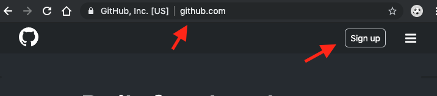
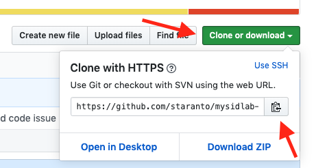
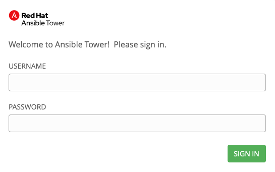

Introduction to Red Hat Ansible Immersion Lab

Table Of Contents
1. Preface
    1. [Confidentiality, Copyright and Disclaimer](#confid)
    1. [About Sirius](#aboutsirius)
1. [About This Document](#aboutdoc)
1. Lab Introduction
    1. Goals
    1. The Environment
1. Labs
    1. Lab 1: Provision EC2 Instance & Deploy Sample Application 

## Preface

### <a name="confid">Confidentiality, Copyright and Disclaimer</a>

This is a Customer-facing document between Sirius Computer Solutions, Inc. and its customer(s).

#### Copyright© 2019 Sirius Computer Solutions, Inc. All Rights Reserved. No part of the work covered by the copyright herein may be reproduced or used in any form or by any means — graphic, electronic, or mechanical, including photocopying, recording, taping, or information storage and retrieval systems — without permission in writing from Sirius except as is required to share this information as provided with the aforementioned confidential parties.

#### This document is not a quote and does not include any binding commitments by Sirius

### <a name="aboutsirius">About Sirius</a>

## <a name="aboutdoc">About This Documement</a>

This document provides information relevant to the following work:
Introductory Ansible training for roles interested in automating common data center tasks.

## Lab Introduction

### Goals

### The Environment

The labs will use an environment consisting of:
1.  Indiviudal GitHub accounts and source code repositories.  Each attendee will need to have their own GitHub account (see Prerequisites).
2.  Ansible Automation Tower.
3.  Amazon AWS.

Each attendee will have an Ansible Tower account assigned to them (siduser1 - siduser12).  The password will be provided.

### Prerequisites

Each attendee will need to have their own GitHub account.  To create an account, visit https://github.com and click on "Sign up".

There are no other prerequisites or software required on your workstation other than a browser.  The labs are entirely browser-based.

## Labs

### Lab 1: Provision EC2 Instance & Deploy Sample Application

This lab will provision a small virtual machine on AWS and deploy a simple web application to it.

1. All artifacts needed to complete this demo are in the fiveout/mysidlab-infra repository on GitHub.  You should fork this repository to your personal GitHub account.
    1.  Make sure you're logged in to GitHub and go to https://github.com/fiveout/mysidlab-infra.

    1.  Fork (ie. make a copy of) this repository by selecting "Fork".

    

    A copy of the repository will be made and located in your GitHub workspace.  Note that that URL will have changed to reflect your individual account.

    Take note of that new URL by select "Clone or download" and then copying it to your clipboard.  You'll need this URL when configuring your Ansible Tower project.  

    

1. Open The Red Hat Ansible Tower administration console in your browser by going to https://tower.mysidlabs.com.  Note: If you are warned about an invalid certificate, you can acknowledge the warning and continue.

1. Login with your assigned USERNAME (siduser1-siduser12) and PASSWORD.

The first step in configuring Ansible Tower is to create an integration to the personal GitHub repository that you created above.  This is done by creating a new Project in Tower.

4.  Choose Project from the left-hand navigation menu and then the green "+" to add a new project.  Complete the new project information as below.  Note that the "
SCM URL" field should contain the GitHub repository URL you copied to your clipboard previously.

