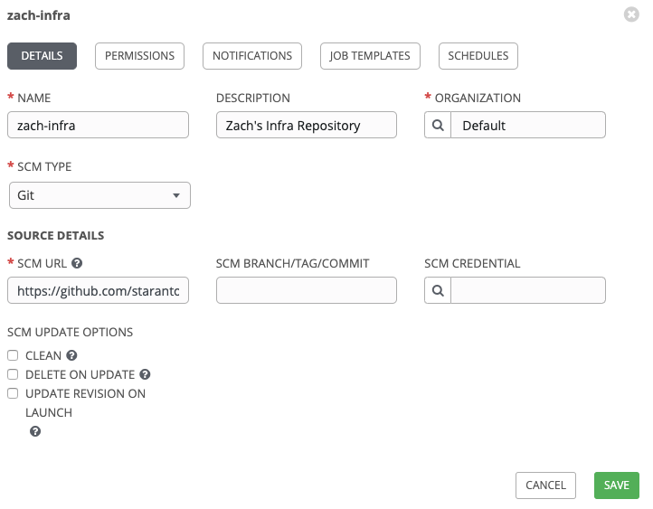
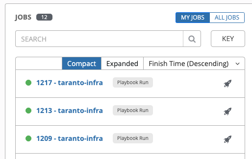

# Introduction to Red Hat Ansible Immersion Lab

Table Of Contents
1. Preface
    1. [Confidentiality, Copyright and Disclaimer](#confid)
1. [About This Document](#aboutdoc)
1. [Lab Introduction](#lab-intro)
    1. [Goals](#lab-goals)
    1. [The Environment](#lab-env)
1. Labs
    1. [Prerequisites](#lab-pre)
    1. [Lab 1: Provision EC2 Instance & Deploy Sample Application](#lab-1)

## Preface

#### This document is not a quote and does not include any binding commitments by Sirius

## <a name="aboutdoc">About This Documement</a>

This document provides information relevant to the following work:
Introductory Ansible training for roles interested in automating common data center tasks.

## <a name="lab-intro">Lab Introduction</a>

### <a name="lab-goals">Goals</a>

### <a name="lab-env">The Environment</a>

The lab environment consists of:
1.  Individual GitHub accounts and source code repositories.  Each attendee will need to have their own GitHub account (see Prerequisites).
2.  Ansible Automation Tower.
3.  Amazon AWS.

Each attendee will have an Ansible Tower account assigned to them (siduser1 - siduser12).  The password will be provided.

## Labs

### <a name="lab-pre">Prerequisites</a>

Each attendee will need to have their own GitHub account.  To create an account, visit https://github.com and click on "Sign up".

There are no other prerequisites or software required on your workstation other than a browser.  The labs are entirely browser-based.

### <a name="lab-1">Lab 1: Provision EC2 Instance & Deploy Sample Application</a>

This lab will provision a small virtual machine on AWS and then deploy a simple web application to it.

1. All artifacts needed to complete this lab are in the `fiveout/mysidlab-infra` repository on GitHub.  You should fork this repository to your personal GitHub account.
    1.  Make sure you're logged in to GitHub and go to https://github.com/fiveout/mysidlab-infra.

    1.  Fork (ie. make a copy of) this repository by selecting "Fork".

    

    A copy of the repository will be created and located in your GitHub workspace.  Note that that URL will have changed to reflect your individual account.

    1. Take note of that new URL by selecting "Clone or download" and then copying it to your clipboard.  You'll need this URL when configuring your Ansible Tower project.  

    

1. Open The Red Hat Ansible Tower administration console in your browser by going to https://tower.mysidlabs.com.  Note: If you are warned about an invalid certificate, you can acknowledge the warning and continue.

1. Login with your assigned USERNAME (siduser1-siduser12) and PASSWORD.

#### The first step in configuring Ansible Tower is to add a connection to the personal GitHub repository that you created above.  This is done by creating a new Project in Tower.

4.  Choose Project from the left-hand navigation menu and then the green "+" to add a new project.  Complete and save the  project information as below.  Note that the "SCM URL" field should contain the GitHub repository URL you copied to your clipboard previously.

#### You can now configure Ansible Tower to run an automation job that is in your GitHub repository.  This job will provision a small VM instance on AWS and then deploy a simple web app to it.

5.  Choose Template from the left-hand navigation menu and then the green "+" to add a new template. Select "Job Template".  Complete and save the new template information as below.  The "PROJECT" field should reference the new Project you created previously.

#### Let's take a look at the two YAML documents that define the "steps" that Ansible will take.  In your GitHub repository, open the aws_sandbox_deploy.yml document.  A few things to note --

a. The "vars" section defines several variables that will be used by Ansible's built-in AWS API to provision the VM instance.

b. The "tasks" section defines a series of "state requirements" that will be reviewed to make sure that they exist on that VM.

c. The final entry (Ensure sample application is available) references an Ansible role that is defined seperately in the roles/my_awesome_role directory of your repository.  This role will be executed as the final step of the job.

6. After your Template definition has been saved, you can create and run a Job based on it.  Select Template from the left-hand navigation menu and then click the rocket icon next to your template to create and execute the Job.

    A running log of the job actions will be displayed and refreshed automatically.

    

7. When the Job completes, a summary (Play Recap) will be displayed.  Take note of the IP address and if there were any errors during the Job.

    

8. Confirm that the VM instance was created and the demo web app was deployed properly by running the application at the IP address in the recap.  The address is the public IP of the provisioned VM instance.

    

9. In Tower, select My View from the left-hand navigation menu  Note that a complete history of your executed Jobs is maintained and available for review.
    
    
